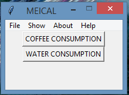

# Objectives

<ul>
<li> Learn more about data science</li>
<li> monitoring some everyday activities </li>
</ul>

## Dependencies

 <ul>
  <li> csv (conda install -c anaconda csvkit) </li>
  <li> second way to install csv ( pip install python-csv) </li> 
  <li> matplotlib (conda install -c conda-forge matplotlib) </li>
  <li> second way to install matplotlib (pip install matplotlib) </li>
</ul>

**Current Version**

 

## Keybinds

<ul>
<li>COFFEE CONSUMPTION(Ctrl+C)</li>
<li>WATER CONSUMPTION(Ctrl+W)</li>
<li>Exit(Alt+F4)</li>
<li>Show Comparison(Alt+S)</li>
<li>Show Water(Alt+W)</li>
<li>Show Coffee(Alt+C)</li>
<li>About(Ctrl+I)</li>
<li>Help(Ctrl+F1)</li> 
</ul>
